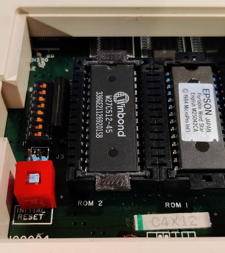

# Epson PX-8 / PX-4 ROM Carrier

Andy Anderson 2020

This is a 3d printable ROM carrier for mounting ROMs in the capsule sockets of the Epson PX-8 and PX-4 portable computers.

You may need to tweak some of the measurements (near the top of RomCapsule.scad) if your 3d printer performs differently to mine, or your ROM sockets have different tollerances (I have 2 PX-8 and the fit is tighter on one of them). It can help to chamfer the sharp edges on the bottom printed carrier with a scalpel.

The STL file can be generated by loading RomCapsule.scad into OpenSCAD (https://www.openscad.org/).

When printing you will need to enable supports to allow the horizontal tabs to print successfully.

For info:

One of my PX-8 has the following part numbers;

* ROM socket: 8878 28S MOLEX 5
* ROM carrier: MOLEX 5 8878

The other has;

* ROM socket: 5500 28 8878 MXJ 2
* ROM carrier: MXJ 4 5501

The MOLEX carrier is a tight fit in the MXJ socket. I based the measurement for this reproduction on the MXJ carrier.

